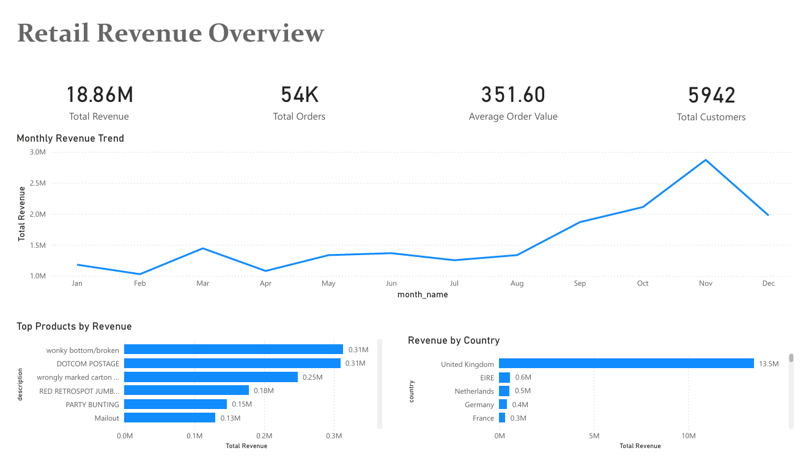
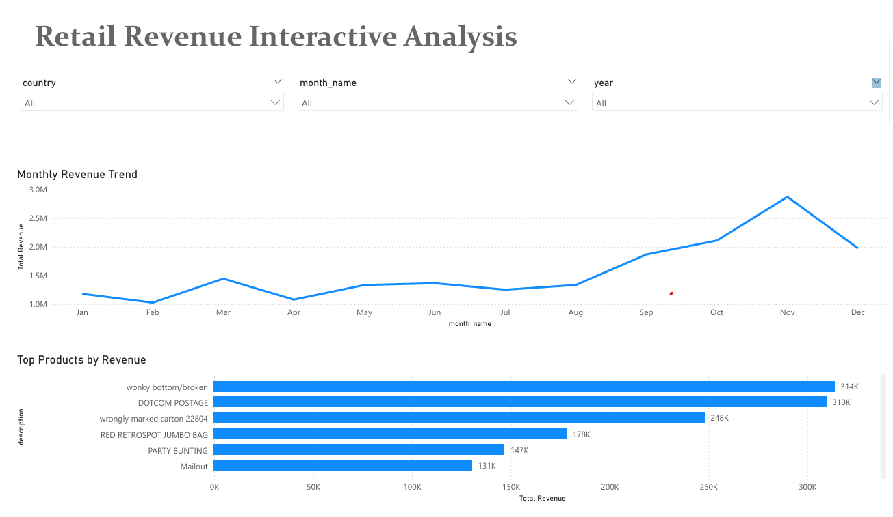
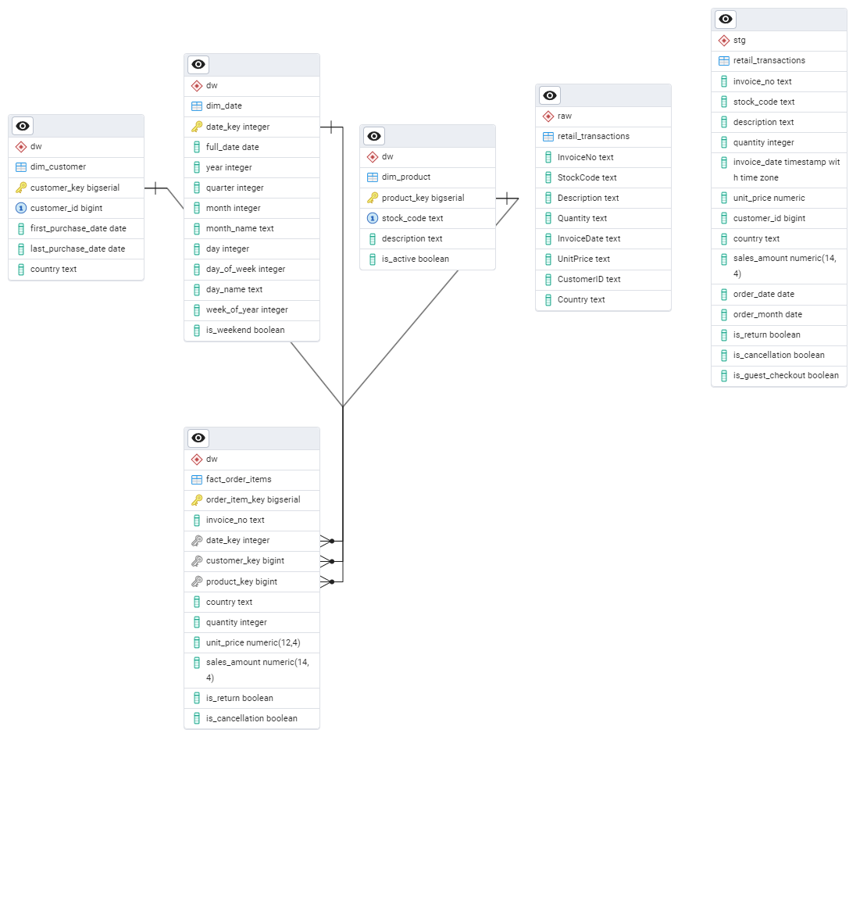

# Retail Revenue and Customer Analytics Data Warehouse

## Overview

This project builds an enterprise-style retail analytics data warehouse using PostgreSQL to analyze revenue performance, customer behavior, and key business metrics.

The system processes over **1 million e-commerce transactions** from the **Online Retail II dataset** and transforms raw transactional data into a structured dimensional model that supports business intelligence and reporting.

The project simulates a real-world analytics engineering workflow where raw operational data is transformed into a scalable analytics warehouse and visualized through an interactive BI dashboard.

Key components of the project include:

- Data warehouse architecture
- Data transformation pipelines
- Dimensional star schema modeling
- SQL-based KPI analysis
- Interactive Power BI dashboard

---

# Dashboard

## Executive Overview

This page provides a high-level business summary including:

- Total Revenue
- Total Orders
- Average Order Value
- Total Customers
- Monthly Revenue Trend
- Top Performing Products
- Revenue by Country

This page answers the question:

**"How is the business performing overall?"**

---

## Interactive Analysis

This page allows deeper exploration using dynamic filters.

Available filters include:

- Country
- Month
- Year

The visuals update interactively based on selected filters, allowing users to explore questions such as:

- How does product performance change by country?
- What are the revenue trends for a specific year?
- Which products drive sales in different markets?

---

# Architecture

The warehouse follows a layered architecture commonly used in modern analytics systems.

Raw Data → Staging Transformations → Dimensional Warehouse → Business KPIs → Dashboard

---

# Raw Layer (`raw` schema)

The raw layer stores the dataset exactly as it is received from the source file.

Purpose:

- Preserve original source data  
- Ensure reproducible transformations  
- Maintain separation between source data and transformed data  

Table:

`raw.retail_transactions`

---

# Staging Layer (`stg` schema)

The staging layer cleans and standardizes the raw dataset before loading it into the warehouse.

Transformations include:

- Data type casting  
- Duplicate removal  
- Header artifact removal  
- Null value handling  

Derived metric:

`sales_amount = quantity * unit_price`

Extracted fields:

- order_date  
- order_month  

Additional flags created:

- is_return  
- is_cancellation  
- is_guest_checkout  

Table:

`stg.retail_transactions`

---

# Dimensional Model (`dw` schema)

The warehouse uses a **star schema** to enable efficient analytical queries.

Dimension Tables

- `dw.dim_date`
- `dw.dim_customer`
- `dw.dim_product`

Fact Table

- `dw.fact_order_items`

Fact table grain:

**One row per invoice line item**

This structure enables scalable analysis across:

- Time
- Customers
- Products
- Geography

---

# Data Warehouse Schema

---

# Dataset

Source:  
Online Retail II — UCI Machine Learning Repository

The dataset contains UK-based e-commerce transactions recorded between **December 2009 and December 2011**.

Dataset scope after cleaning:

| Metric | Value |
|------|------|
| Transactions | 1,033,036 |
| Customers | 5,942 |
| Products | 5,304 |
| Date Range | Dec 2009 – Dec 2011 |

---

# Key Business Metrics

All KPIs are calculated directly from the dimensional warehouse using SQL.

Financial Metrics

- Total Net Revenue: **£20,317,584**
- Average Order Value (AOV): **£448.16**

Top Revenue Countries

| Country | Revenue |
|------|------|
| United Kingdom | £17.25M |
| EIRE | £658K |
| Netherlands | £554K |
| Germany | £425K |
| France | £350K |

---

# Customer Analytics

The warehouse enables advanced behavioral analysis including:

- Repeat purchase rate
- Monthly cohort retention analysis
- Revenue concentration analysis using decile ranking
- Month-over-month revenue growth using window functions

---

# Technologies Used

- PostgreSQL  
- pgAdmin 4  
- SQL  
- Power BI  

---

# SQL Concepts Applied

- Star schema dimensional modeling
- Surrogate key generation
- Fact and dimension joins
- Window functions (`LAG`, `NTILE`)
- Cohort retention modeling
- Revenue concentration analysis
- Date spine generation using `generate_series()`
- Data validation and deduplication

---

# Analytical Capabilities

The warehouse enables analysis such as:

- Monthly revenue trend analysis
- Average order value calculations
- Revenue by geography
- Revenue by product
- Customer cohort retention up to 24 months
- Revenue concentration analysis for top-performing customers

---

# Reproducing the Project

Run the SQL pipeline in order:

1. `sql/00_setup.sql`  
2. `sql/01_raw_tables.sql`  
3. Import dataset into `raw.retail_transactions`  
4. `sql/03_staging_transform.sql`  
5. `sql/04_dw_dimensions.sql`  
6. `sql/05_dw_facts.sql`  
7. `sql/06_kpis.sql`  

Each script builds one layer of the warehouse architecture.

---

# Project Outcomes

This project demonstrates the ability to:

- Design and implement a dimensional data warehouse
- Transform large transactional datasets into analytical models
- Build scalable SQL data pipelines
- Create business KPIs directly from warehouse tables
- Build interactive BI dashboards for decision making

---

